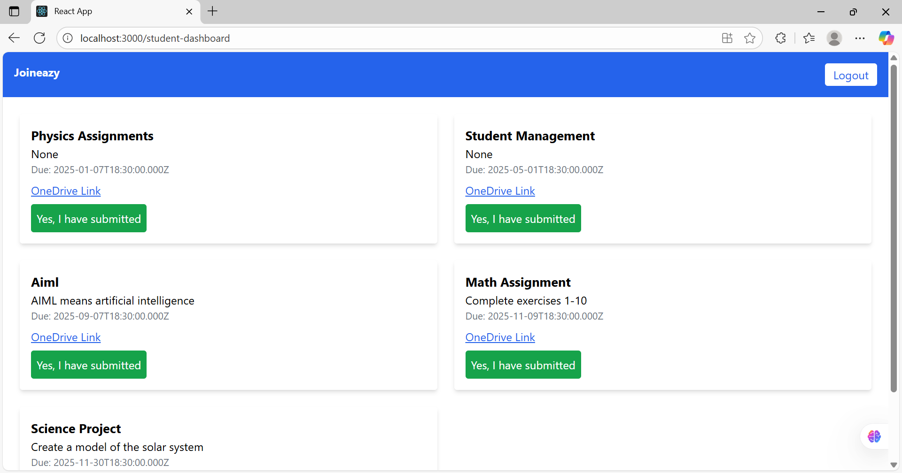

# 🎓 Student Management System

A simple web application that helps **students** and **professors** manage assignments, groups, and submissions efficiently.

---

## 📋 Description

The system has two roles:
- **Student** – Can view and submit assignments.
- **Admin (Professor)** – Can create, manage, and grade assignments.

It is built using **React**, **Tailwind CSS**, **Node.js**, **Express**, and **PostgreSQL**..

### 📸 Demo Preview

📸 Preview

**Login Page**  

**Student Dashboard**  

**Admin Dashboard**  

🎥 [Demo Video](https://1drv.ms/v/c/138af1d99a2d471a/EbhN33bMcl1NvzwKWveQrIEBbOtREBWVMkAzJqtg0CB3cw)

